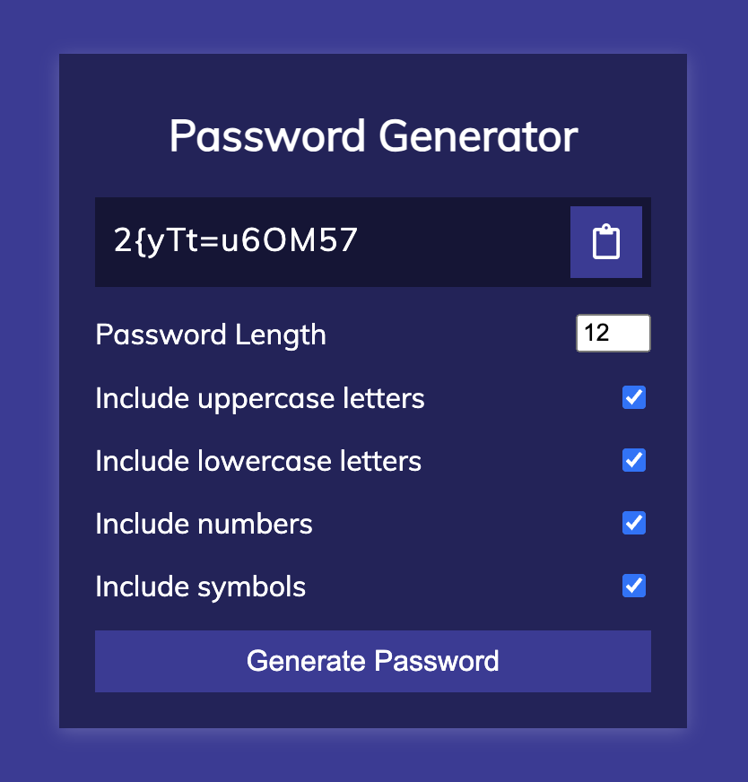

# Генератор паролей

## Описание

Учебный мини-проект генератора паролей, созданный на основе HTML, CSS и JavaScript.

Генератор позволяет выбрать количество символов, наличие строчных и заглавных букв, цифр и символов. Все выбранные параметры генерируются в случайном порядке. Присутсвует кнопка для копирования пароля в буфер обмена.

> Данный проект является одним из 50 учебных проектов, выполненных по урокам на платформе [Udemy](https://www.udemy.com/course/50-projects-50-days/?referralCode=684EE5F9DE1745B6428B&couponCode=ST7MT41824).